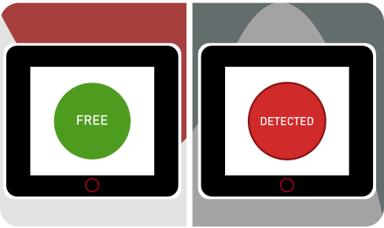

# Demo Espressif/Holtek Electronica 2022 
This repo contains the code and the design files used for the Electronica 2022 trade fair demo.
The demo is based on an [ESP-Box](https://github.com/espressif/esp-box) which an evk around an [ESP32-S3-WROOM](https://www.espressif.com/sites/default/files/documentation/esp32-s3-wroom-1_wroom-1u_datasheet_en.pdf) module. The ESP-Box back connector is used to link the three pins as showed in the table below. 

|ESP-BOX | BM32S2031 | Description|
|---|---|---|
| VDD | VDD | 3.3V Supply |
| GND | GND | Ground |
| GPIO 38 | D or I/O out | Sensor output pin |


The code is forked from the example [image_display](https://github.com/espressif/esp-box/tree/master/examples/image_display) in the Esp-Box example folder. 

## Get started

You will need:
* Esp-box
* BM32S2031 module
* A few cables


For a general getting started tutorial you can check here [Get started with Esp-box](https://fbez.github.io/documentation/ESP-Box-getting-started.html). The important thing to notice is that generally you need to copy the components directory in your project or download the dependencies through the component registry. For the sake of easiness, these folders have already been included in this repo. Before moving on, go through the tutorial, compile and flash the `image_display` example. 

Solder one end of the cables to the module and connect them as shown in the table above. 

Clone the repo in your system
```git clone --recursive https://github.com/Ineltek-IT/Electronica2022Demo-esp-holtek.git```
Move to the `Electronica2022Demo-esp-holtek` directory and open the workspace in vscode. At this point you should be able to call `ESP-IDF: Build, Flash and start monitor on your device`.

At this point you should see the button staying green ("Free") if no object is directly in front of it, while turning red ("Detected") if there something facing it. The typical detection distance is 80cm. 

 


## How does it work

The graphical UI is done through [LVGL](https://lvgl.io/). The sensor is added as an [input device](https://docs.lvgl.io/8/overview/indev.html).

```c
    lv_indev_drv_t indev_drv;
    lv_indev_drv_init(&indev_drv);      /*Basic initialization*/
    indev_drv.type = LV_INDEV_TYPE_BUTTON;  /* Sensor as simple on/off button */
    indev_drv.read_cb =sensor_read;        
    /*Register the driver in LVGL and save the created input device object*/
    lv_indev_t * my_indev = lv_indev_drv_register(&indev_drv);
    lv_indev_set_button_points(my_indev, points_array);
```

and to it is given `sensor_read` as a callback function. `sensor_read` reads the output of the sensor and changes the appearance of the button, adding to and removing from it the `LV_STATE_PRESSED` property. 

```c
void  sensor_read(lv_indev_drv_t * drv, lv_indev_data_t*data){
    int btn_pr = gpio_get_level(SENSOR_OUTPUT); 

    if(btn_pr!=last_sensor_state){ // Enter only if the state is changed, otherwise it keeps calling the 
        if(btn_pr > 0) {               /*Is the button pressed? If so, add the state PRESSED to it, to see the change in appearance*/
            lv_label_set_text(label1, "FREE");
            lv_obj_clear_state(btn,  LV_STATE_PRESSED );
        } else {
            lv_label_set_text(label1, "DETECTED");
            lv_obj_add_state(btn,  LV_STATE_PRESSED );           
        }
        last_sensor_state=btn_pr;
    }

}
```

The property is linked to a red background and dark red border. 


## References
* [Get started with Esp-box](https://fbez.github.io/documentation/ESP-Box-getting-started.html)
* [BM32S2031 Datasheet](https://www.holtek.com/documents/10179/116711/BM32S2031-1v100.pdf)
* [Ineltek website](https://www.ineltek.com/it/)
* [Holtek website](https://www.holtek.com/)
* [Espressif website](https://www.espressif.com/)