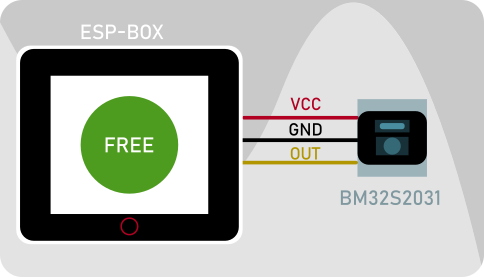

# Demo Espressif/Holtek Electronica 2022 
This repo containes the files used for the Electronica 2022 trade fair demo.
The demo is based on an Esp-box which mounts an ESP32-S3-WROOM SoC. The back connector is used to connect 

|ESP-BOX | BM32S2031 | Description|
---
| VDD | VDD | 3.3V Supply |
| GND | GND | Ground |
| GPIO 38 | D or I/O out | Sensor output pin |

